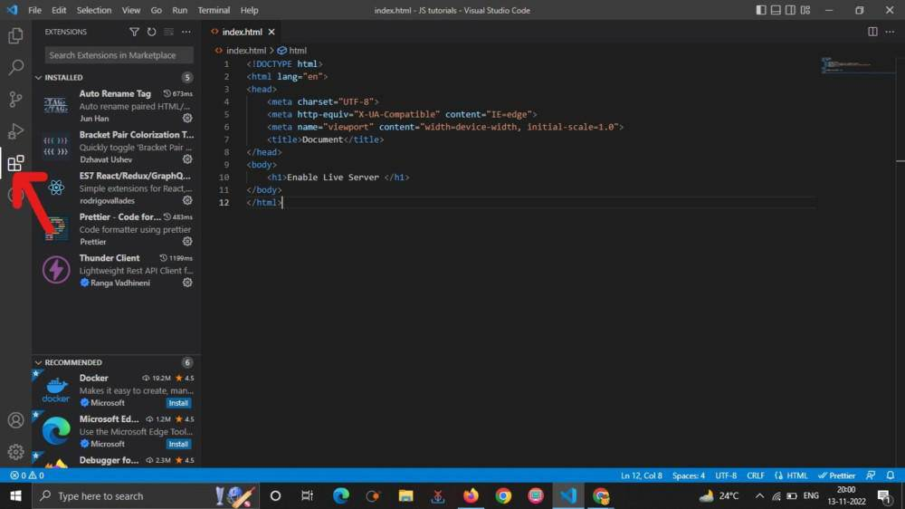
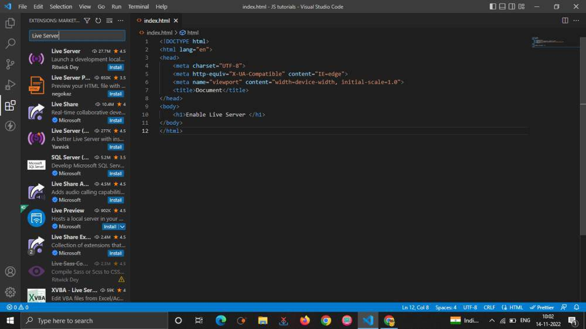
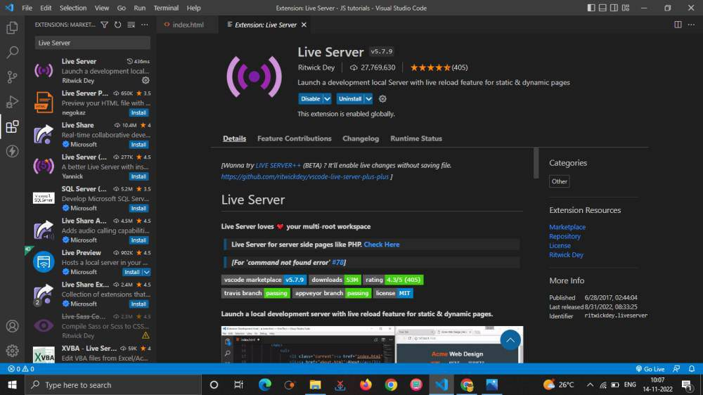
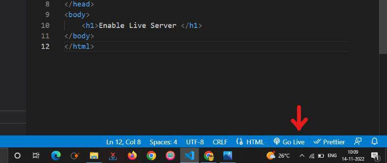
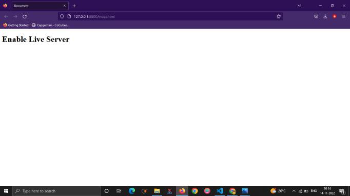

# DevLabs 2.0

## Steps to Follow for the DevLabs

### Clone the Repo

```bash
git clone https://github.com/Jaswanth-Kumar-2007/DevLabs_2.0.git
```

### Create the Branch with your Name

```bash
git branch {Your_Name}
```

### Change the Main Branch to your Branch

```bash
git checkout {Your_Name}
```

### Add your Changes

```bash
git add .
```

### Commit your Changes in Code

```bash
git commit -m {What Change you Done}
```

### Push the Changes in the Code When you Update

```bash
git push -u origin  {Your_Name}
```

## Week 1

| Date     | Day       | React Activity                                      |
|----------|-----------|-----------------------------------------------------|
| 26 May   | Monday    | Session: Git and Github                             |
| 27 May   | Tuesday   | GitStartedWithUs                                    |
| 28 May   | Wednesday | Resources: HTML and CSS                             |
| 29 May   | Thursday  | Session: HTML                                       |
| 30 May   | Friday    | Collaborative Task: HTML                            |
| 31 May   | Saturday  | Session: CSS                                        |
| 1 June   | Sunday    | Collaborative Task: CSS (Add CSS to previous HTML)  |

---

## Resources for Week 1

Git and GitHub Resources : Release Soon ....

HTML , CSS Resources : Release Soon ....

### HTML Basic Structure

```html
<!DOCTYPE html>
<html lang="en">
<head>
    <meta charset="UTF-8">
    <meta name="viewport" content="width=device-width, initial-scale=1.0">
    <title>Document</title>
</head>
<body>
    
</body>
</html>
```

Source for You By Me :

- [Introduction to Git and Github](https://github.com/Jaswanth-Kumar-2007/Introduction-to-Git-and-GitHub/blob/main/Git%26GitHub.md)

- [HTML W3 Schools](https://www.w3schools.com/html/default.asp)

- [CSS W3 Schools](https://www.w3schools.com/css/default.asp)

### Prerequisites for Web Developer

#### Code Editor

VS Code - [VS Code Download](https://code.visualstudio.com/download)

CodePen (For HTML , CSS , JS) - [CodePen Online Editor](https://codepen.io/pen/)

#### Live Server

- Open Extension Panel



- Search for Live Server



- Verify the Installation



- Launch Live Server



- Live Preview in Browser



- Image Credits by Geeks for Geeks

## Week 2

| Date     | Day       | React Activity                                                                  |
|----------|---------- |---------------------------------------------------------------------------------|
| 2 June   | Monday    |Resources:JS                                                                     |
| 3 June   | Tuesday   | Session: JS                                                                     |
| 4 June   | Wednesday | -                                                                               |
| 5 June   | Thursday  | Collaborative Task: JS                                                          |
| 6 June   | Friday    | Resources: React                                                                |
| 7 June   | Saturday  | React Intro Session (what is React, components, setup, folder structure)        |
| 8 June   | Sunday    | Initialize React App (Vite + optional Tailwind, project structure setup)        |

---

## Resources for Week 2

JS Resources : Release Soon ...

Source for You By Me :

- [JavaScript W3 Schools](https://www.w3schools.com/js/default.asp)

- [React W3 Schools](https://www.w3schools.com/react/default.asp)

## Week 3

| Date     | Day       | React Activity                                                                 |
|----------|---------- |--------------------------------------------------------------------------------|
| 9 June   | Monday    | Collaborative Task: Initialize different screens/files                         |
| 10 June  | Tuesday   | Resources: React Props & Navigation                                            |
| 11 June  | Wednesday | -                                                                              |
| 12 June  | Thursday  | Collaborative Task: Components with props, setup routes                        |
| 13 June  | Friday    | Resources: State Management, Forms, Inputs                                     |
| 14 June  | Saturday  | Session: Code Review + next steps discussion                                   |
| 15 June  | Sunday    | -                                                                              |

---

## Resources for Week 3

Release Soon ...

## Week 4

| Date     | Day       | React Activity                                                                 |
|----------|---------- |--------------------------------------------------------------------------------|
| 16 June  | Monday    | Collaborative Task: Add states to components                                   |
| 17 June  | Tuesday   | -                                                                              |
| 18 June  | Wednesday | Task: Layout, Notes Screen, Tasks Screen completion                            |
| 19 June  | Thursday  | Session: Authentication Basics (JWT)                                           |
| 20 June  | Friday    | -                                                                              |
| 21 June  | Saturday  | Task: Set up Authentication                                                    |
| 22 June  | Sunday    | Complete Frontend Implementation                                               |

---

## Resources for Week 4

Release Soon ...

## Contributions

### Contribute Here to Get a Place Here ! 🥰

<a href="https://github.com/Jaswanth-Kumar-2007/DevLabs_2.0/graphs/contributors">
  
</a>

---
